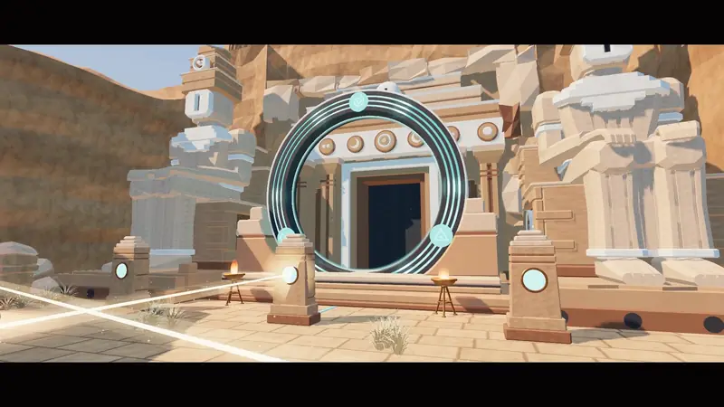
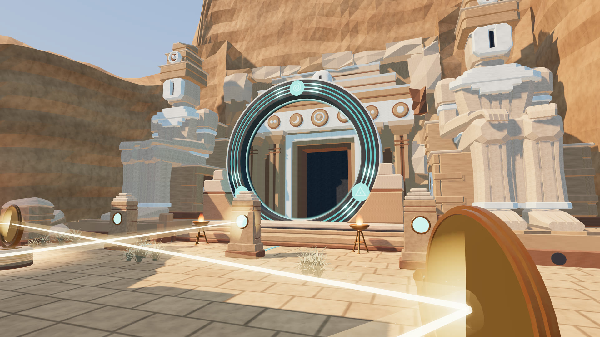
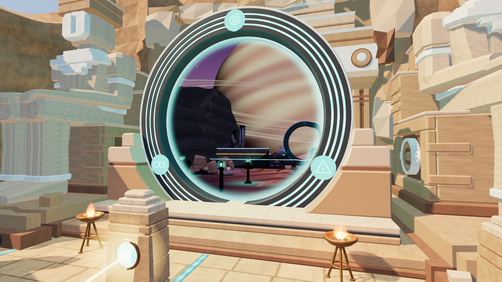
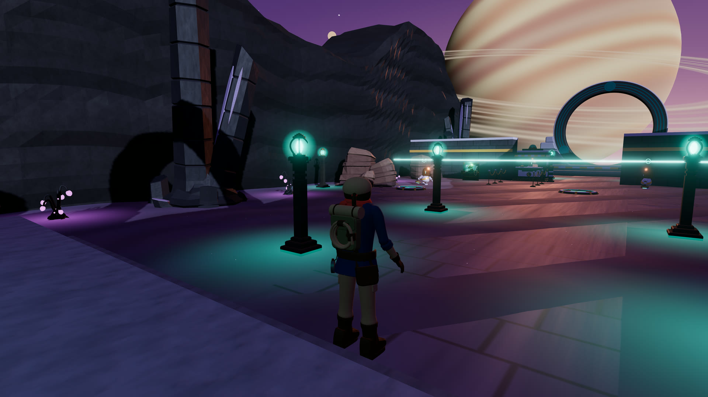
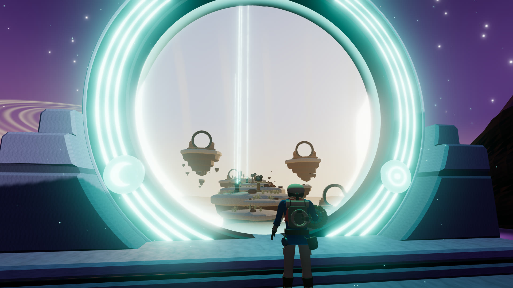
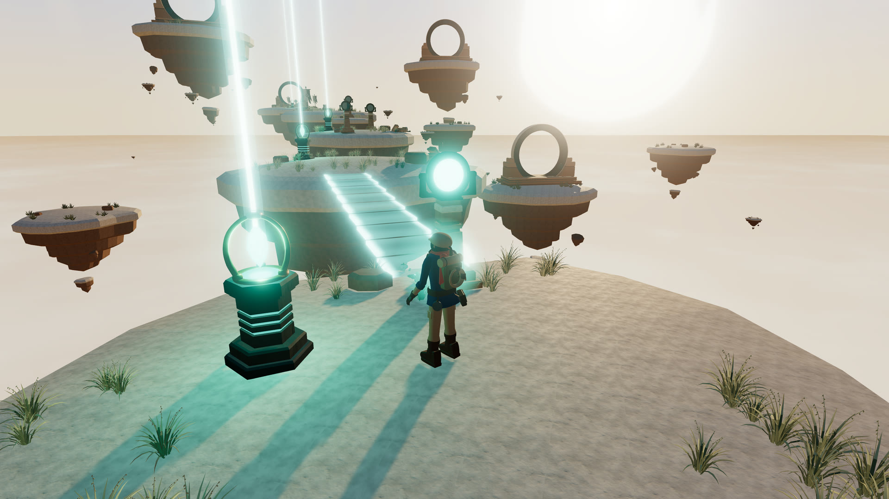
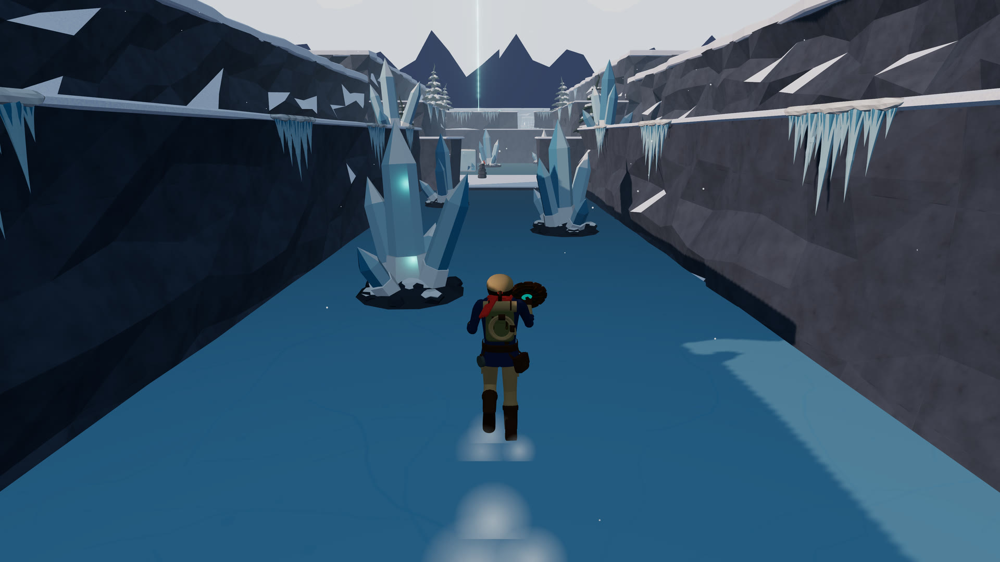
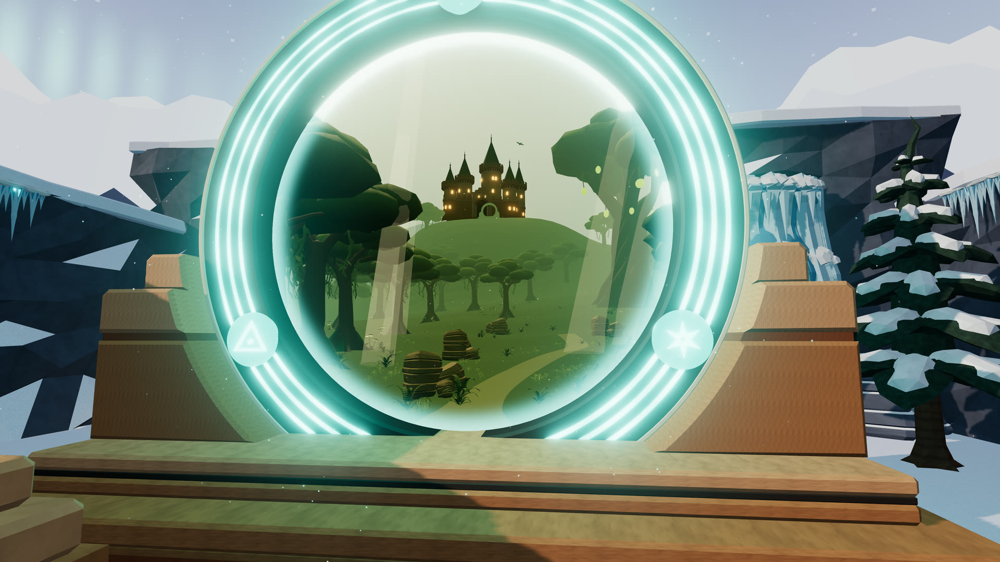
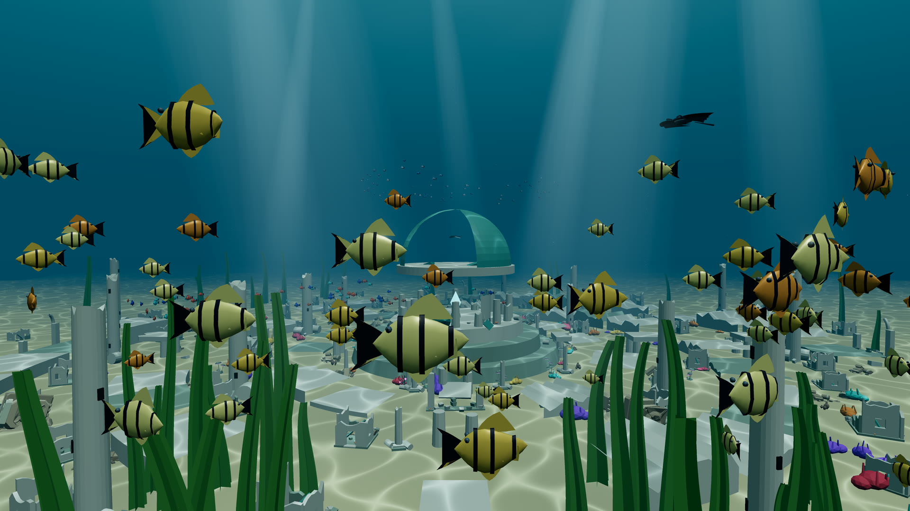

# Farseek

[](https://github.com/Rapiiidooo/farseek/releases/tag/jam-entry)

**[Play it in your browser](https://farseek.rapidoai.dev/)** · **[Watch the trailer](https://github.com/Rapiiidooo/farseek/releases/download/jam-entry/farseek-trailer.mp4)** (95 s, 1080p60, or [720p](https://github.com/Rapiiidooo/farseek/releases/download/jam-entry/farseek-trailer-720p.mp4))

A browser game in four levels. An explorer follows a lost expedition down into a sunken desert ruin and bends sunlight with bronze mirrors onto the three glyphs of an address, and the stone ring before the ruin opens onto another world. There, a gate network's customs checkpoint will not let anyone through without the destination address stamped by its Wardens, who only stamp offenders. A second door opens onto a sky of floating isles, crossed on bridges of light that the builders' pylons throw when struck by a charged sun disc, on an isle that still drifts, over stones that crumble underfoot and through a last relay of pylons on a single charge, to the expedition leader's last camp. Her ring, given two glyphs of three, opens halfway onto a frozen reach: the explorer slides down a frozen stream, pushes blocks of ice across a pond, crosses a lake on thin ice and drifting floes, and frees the missing glyph from the ice with the disc. The address made whole, the last ring opens onto a wild forest; the view flies on through it and up to a castle, where a last door opens on a drowned city in ruins, and the credits follow.

Play it at <https://farseek.rapidoai.dev/>, on a laptop or a phone. Every 3D object is Three.js code produced through the [404 game recipe](https://github.com/404-Repo/404-game-recipe/blob/main/GAME.md) loop: a written brief, three candidates, the verifier's four-sided sheet and a choice by eye. The briefs and sheets are in [receipts/candidates](receipts/candidates/). Every sound, the music included, is synthesized in the browser: a small tune that each world plays in its own mode and voice, with no audio files.

<p>








</p>

The trailer and these stills were captured from the entered release after the jam closed, and the game is unchanged ([how](receipts/trailer/README.md)).

## Run it

```bash
npm install
npm start            # http://localhost:3002
```

Keyboard and mouse, a gamepad, or a touch screen. Movement keys follow the physical layout, so ZQSD works on AZERTY. On a phone, the stick moves (a light push walks and stops at edges, a full push runs), a drag on the picture looks around, and the buttons show the actions that apply. Escape or the pause button pauses; the pause menu and the title menu both reach any level already visited.

## Check it

```bash
node scripts/playthrough.mjs outputs/playthrough   # plays from the title to the credits with real keys
node scripts/menu-check.mjs outputs/menu-check     # menus, levels, pause, the ways back, the notes, a knockout
node scripts/touch-check.mjs outputs/touch-check   # the phone controls and layout, with real touch events
node scripts/music-preview.mjs outputs/music-preview   # renders the music offline: loudness, spectrogram, WAV
node ../404-game-recipe/harness/ship.mjs game       # every module parses, nothing escapes the folder
```

The scripts need the local server running, Google Chrome installed and the recipe cloned beside this folder. The 404 jam gate runs from the recipe folder against the live URL with no options: `node harness/jam.mjs https://farseek.rapidoai.dev/ --commit=<sha>`. The play-through fails if any shader compiles after the first level starts; `--from=w2`, `--from=w3` or `--from=w4` starts it at the checkpoint, on the isles or in the frozen reach.
